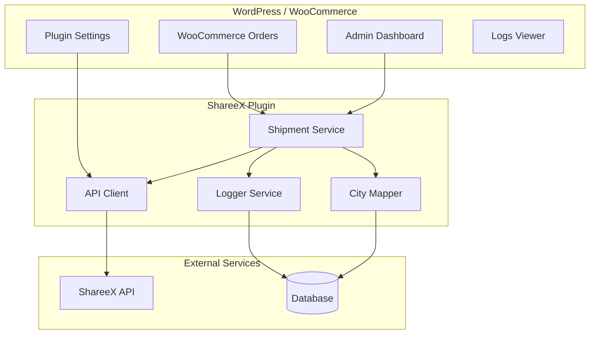
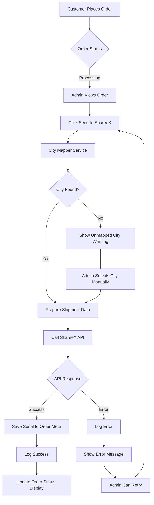
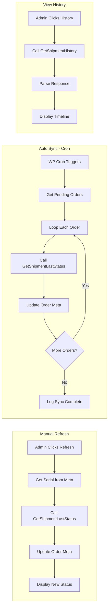
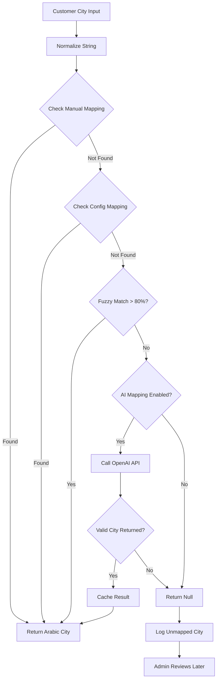
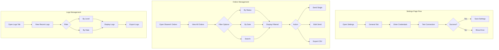
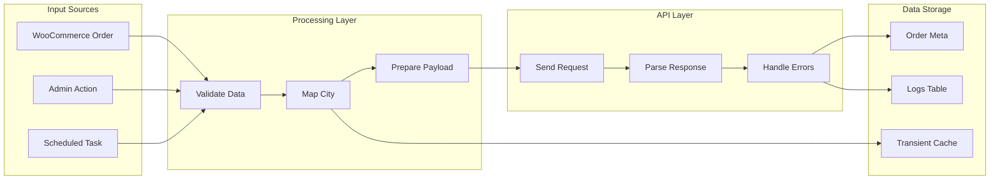
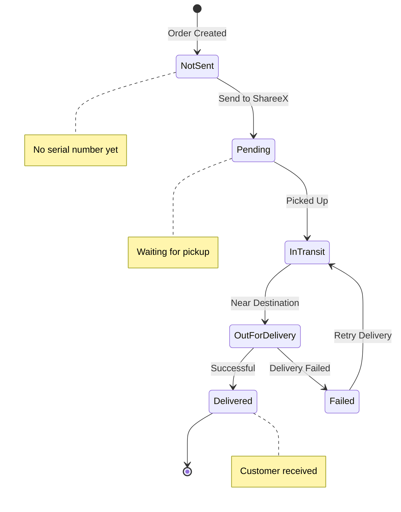
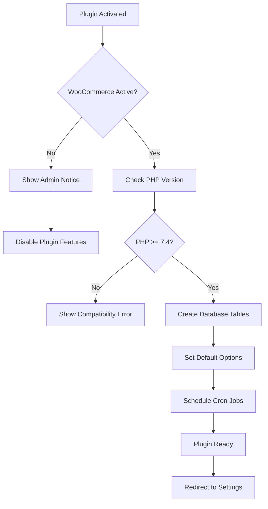

# ShareeX WordPress Plugin - Flow Charts

## 1. System Architecture Overview

---

## 2. Order Shipment Flow

---

## 3. Status Tracking Flow

---

## 4. City Mapping Process

---

## 5. Admin Workflow

---

## 6. Data Flow Diagram

---

## 7. Status State Machine

---

## 8. Plugin Activation Flow

