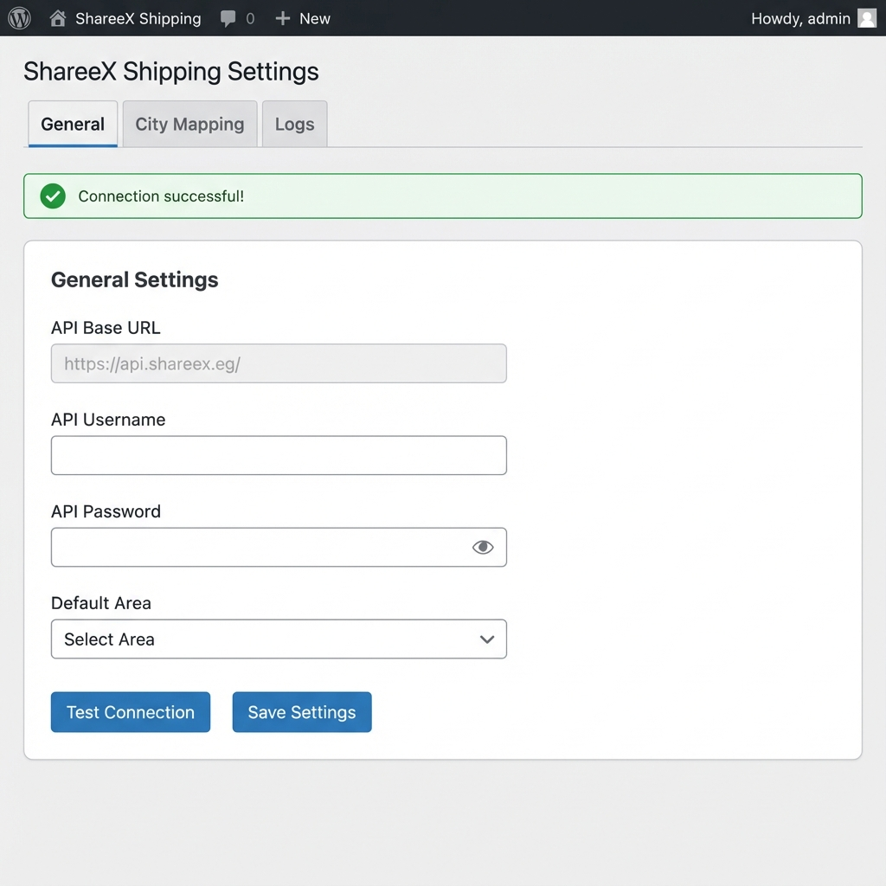
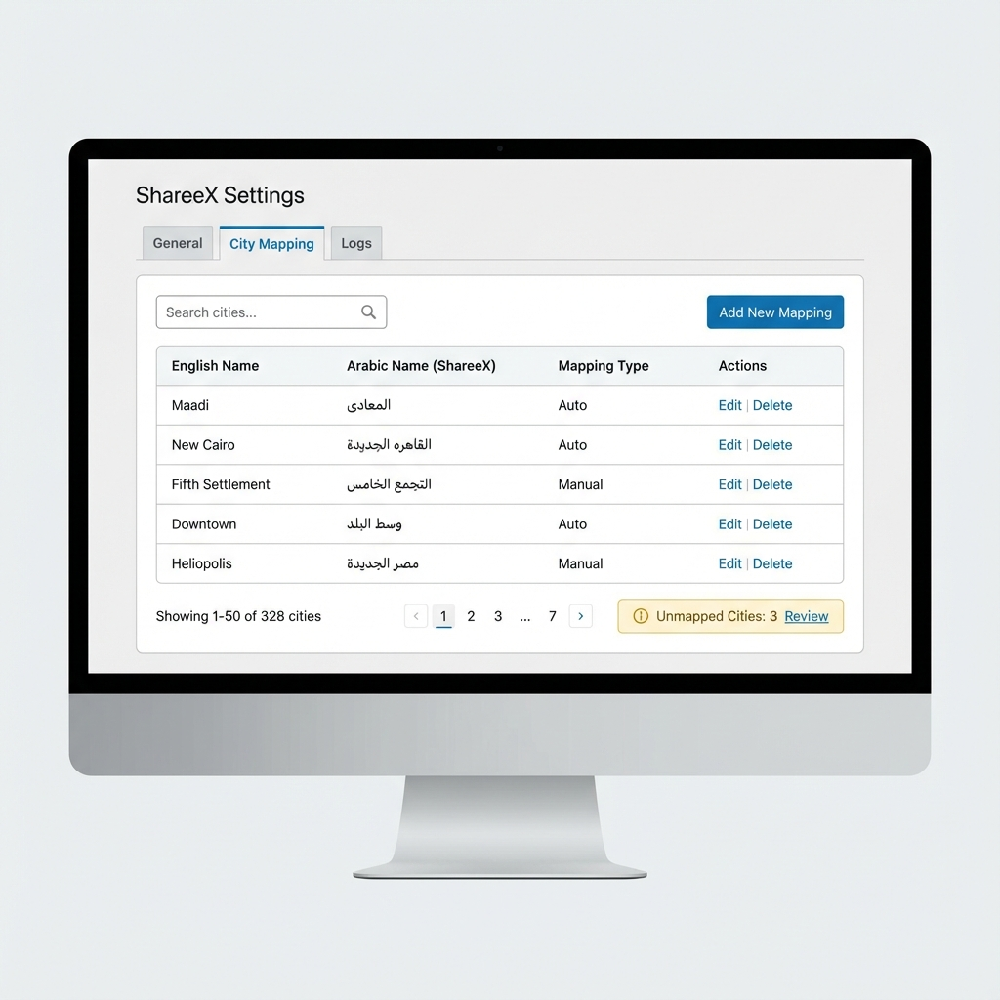
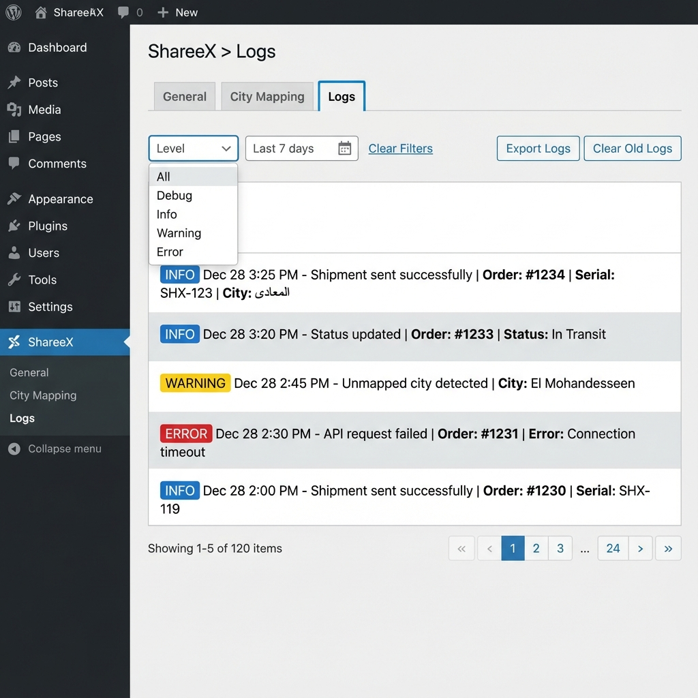
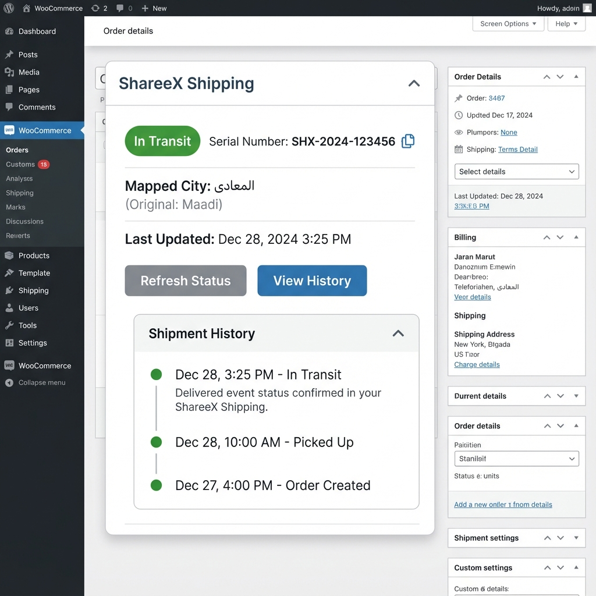
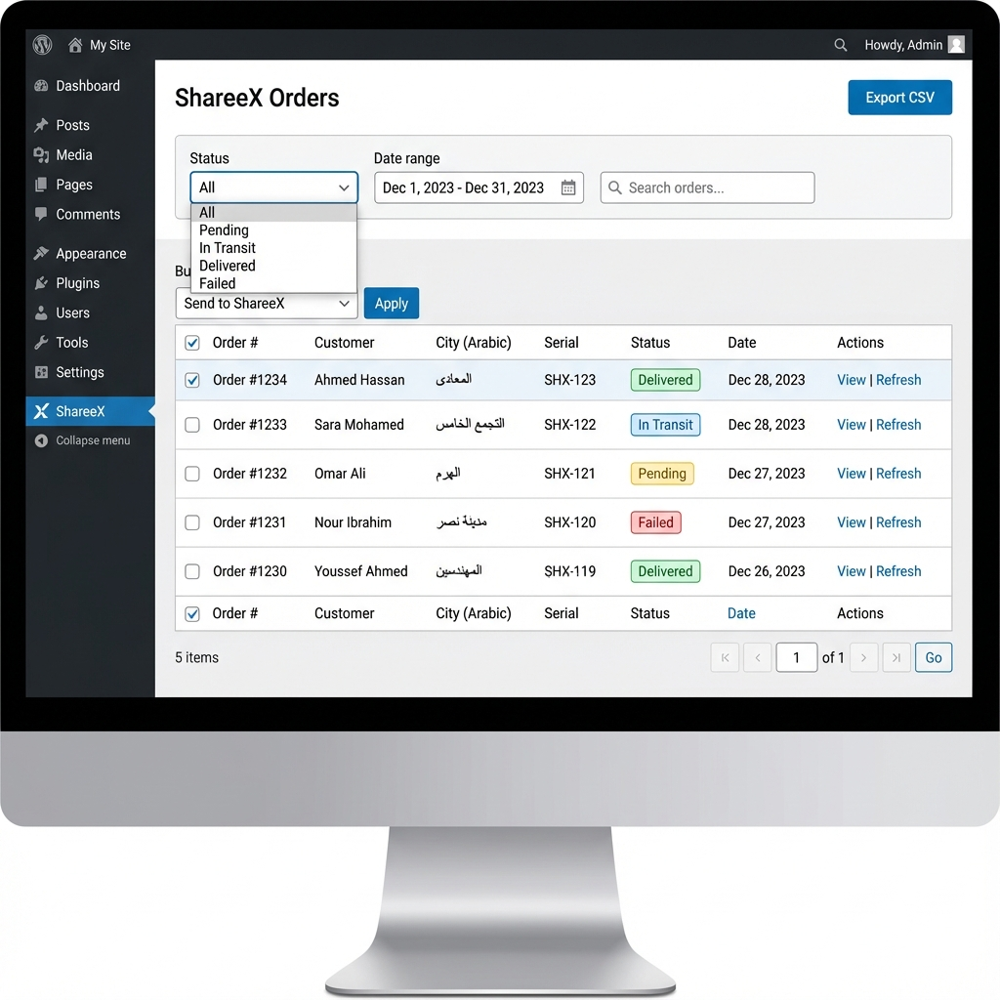
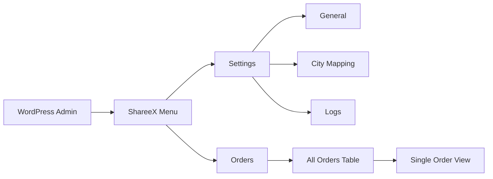

# ShareeX WordPress Plugin - UI Demo Mockups

This document showcases the proposed user interface for the ShareeX Shipping WordPress plugin.

---

## 1. Settings Page - General Tab

The main settings page where administrators configure ShareeX API credentials and default settings.

**Features:**
- API Base URL, Username, and Password fields
- Test Connection button to validate credentials
- Default Area dropdown for fallback city
- Success/error notifications

---

## 2. City Mapping Page

The City Mapping tab allows you to view, search, and manage city mappings between English input and ShareeX Arabic city names.

**Features:**
- Searchable table of 328+ city mappings
- Add custom mappings for unmapped cities
- Edit/delete existing mappings
- "Unmapped Cities" alert for admin review

---

## 3. Logs Page

The Logs tab provides a detailed view of all API interactions and plugin activities.

**Features:**
- Color-coded log levels (Info, Warning, Error)
- Filter by level and date range
- Export logs to file
- Clear old logs option

---

## 4. Order Metabox

This metabox appears on individual WooCommerce order edit pages, showing ShareeX shipping details.

**Features:**
- ShareeX serial number with copy button
- Current status with color badge
- Mapped city (Arabic) with original city shown
- View History accordion with timeline
- Refresh Status and View History buttons

---

## 5. ShareeX Orders Management Page

A dedicated admin page to manage all ShareeX shipments in one place.

**Features:**
- Filterable table by status, date, and search
- Bulk actions (send multiple orders)
- Export to CSV
- Quick actions (View, Refresh) per order
- Status badges (Delivered, In Transit, Pending, Failed)

---

## UI Summary Table

| Screen | Purpose | Key Actions |
|--------|---------|-------------|
| **Settings - General** | Configure API credentials | Test Connection, Save |
| **Settings - City Mapping** | Manage city mappings | Search, Add, Edit, Delete |
| **Settings - Logs** | View activity logs | Filter, Export, Clear |
| **Order Metabox** | Per-order shipping details | Send, Refresh, View History |
| **Orders Page** | Manage all shipments | Bulk Send, Filter, Export |

---

## Navigation Flow

---

## Color Scheme

| Element | Color | Usage |
|---------|-------|-------|
| Primary Button | `#0073aa` | Save, Send, Primary Actions |
| Secondary Button | `#f7f7f7` | Cancel, Secondary Actions |
| Success Badge | `#46b450` | Delivered status |
| Warning Badge | `#ffb900` | Pending status |
| Info Badge | `#00a0d2` | In Transit status |
| Error Badge | `#dc3232` | Failed status |

These colors follow WordPress admin UI guidelines for consistency.
